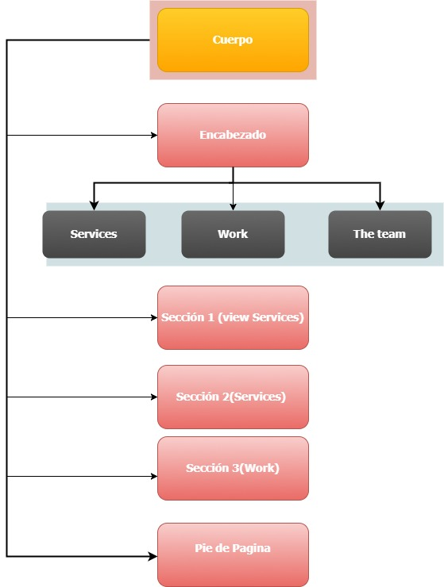

# AppLove
* **Maquetado web con HTML & CSS
***
* **En el siguiente proyecto se nos pide replicar el sitio web App Love:**
***
## Objetivo

El reto consiste en maquetar la web **AppLove**, este es el resultado final:

## Estructura del Sitio Web App Love
- La siguiente imagen representa la estructura visual de la página index.html , y el orden en que el usuario verá el contenido.

## Estructura de archivos
- Dentro del proyecto AppLove encontramos  el archivo `index.html` y 2 carpetas: assets y css
- La carpeta `assets` tiene contenido los recursos a utilizar para nuestro sitio web(imagenes, iconos,etc)
- En la carpeta `css` se tiene un archivo base `main.css` que sera la hoja de estilos a utilar para nuestro proyecto
- El tipo de fuente utilizado es `Raleway`.
